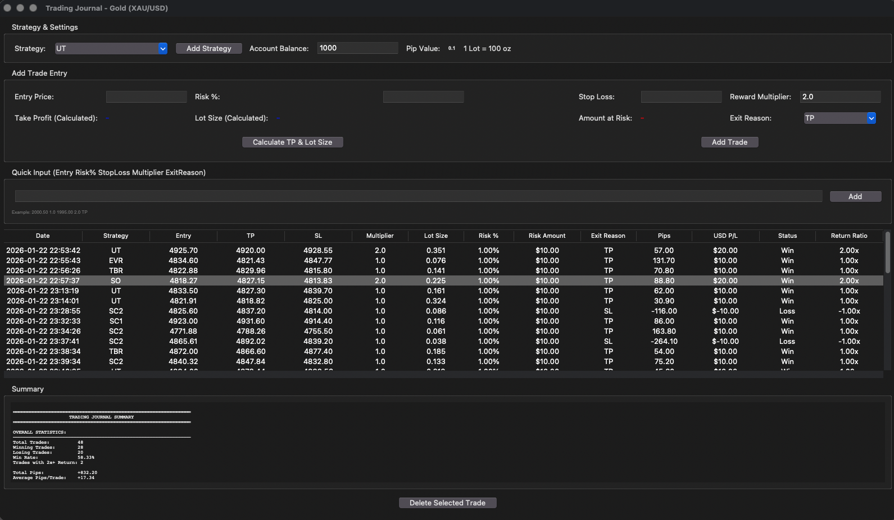

# Trading Journal - Gold (XAU/USD)



A comprehensive trading journal application for Gold (XAU/USD) trading with automatic position sizing, risk management, and MongoDB persistence.

## Features

- **Strategy Tracking**: Track multiple strategies with separate statistics
- **Auto Calculations**: Take Profit, Lot Size, and Risk Amount calculated automatically
- **MongoDB Integration**: Persistent storage with auto-save/load
- **Risk Management**: Built-in risk percentage calculator
- **Summary Statistics**: Overall and strategy-wise breakdown with 2x+ return tracking

## Quick Start

### Installation

```bash
git clone https://github.com/Usamatahir23/trading_journal.git
cd trading_journal
pip install -r requirements.txt
```

### Run

```bash
python -m src.trading_journal.main
```

## Usage

### Adding Trades

**Input Fields:**
1. Enter Entry Price, Risk %, Stop Loss, and Reward Multiplier
2. Click "Calculate TP & Lot Size"
3. Select Exit Reason (TP/SL)
4. Click "Add Trade"

**Quick Input:**
```
EntryPrice RiskPercent StopLoss Multiplier ExitReason
Example: 2000.50 1.0 1995.00 2.0 TP
```

### Calculations

- **Take Profit**: `Entry ± (Entry - SL) × Multiplier`
- **Lot Size**: `Risk Amount / (SL Distance in Pips × $1)`
- **Pip Value**: 0.1 (Gold)
- **1 Lot**: 100 oz

## MongoDB

- **Connection**: `mongodb://localhost:27017/`
- **Database**: `trading_journal`
- **Collections**: `trades`, `summaries`
- Trades auto-save on add, auto-load on startup

## Requirements

- Python 3.7+
- tkinter (included with Python)
- MongoDB (for persistence)
- pymongo

## License

MIT License
